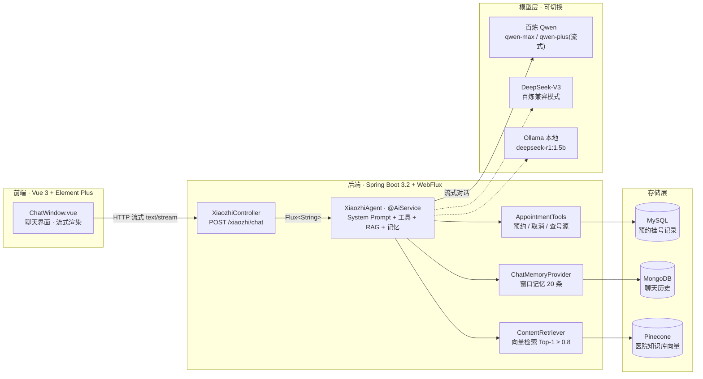
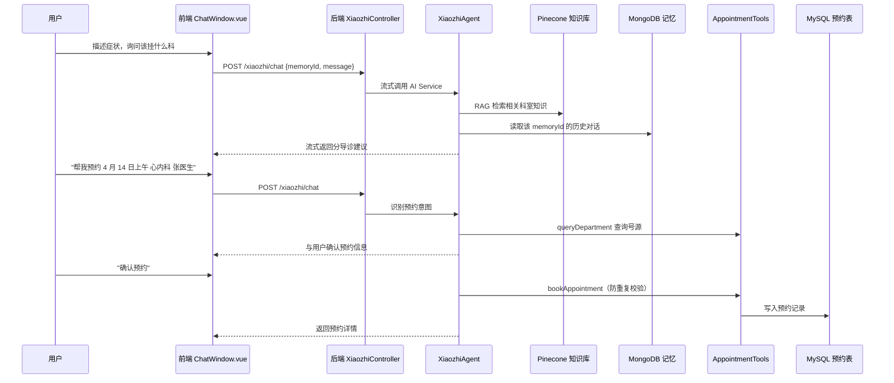
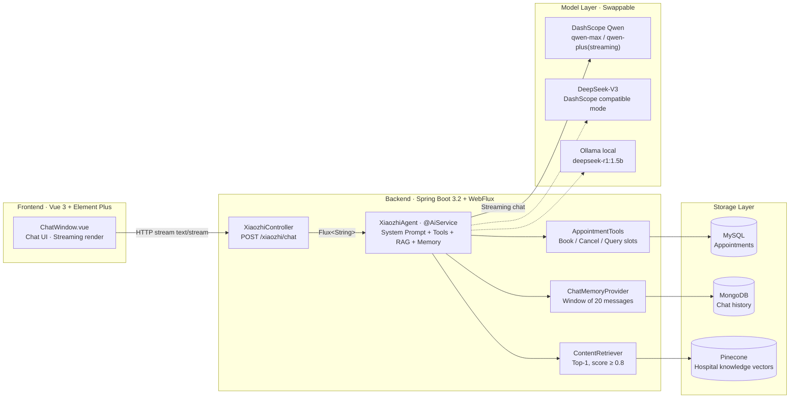
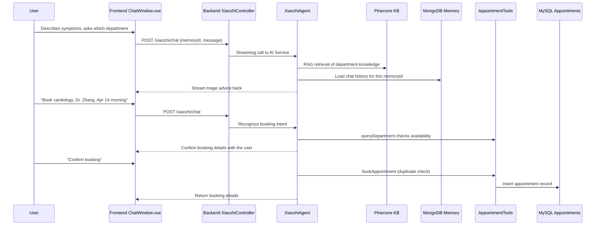

<div align="center">

# 硅谷小智 · Guigu Xiaozhi

**AI 智能伴诊助手 —— 用自然语言完成智能问诊、分导诊与预约挂号的完整 AI 应用**


**[中文版](#中文版) | [English Version](#english-version)**

</div>

---

## 中文版

### 目录

- [项目简介](#项目简介)
- [核心功能](#核心功能)
- [技术架构](#技术架构)
- [项目结构](#项目结构)
- [快速开始](#快速开始)
- [核心机制解析](#核心机制解析)
- [API 文档](#api-文档)
- [测试](#测试)
- [项目亮点](#项目亮点)
- [Roadmap](#roadmap)
- [免责声明](#免责声明)

---

## 项目简介

**硅谷小智**是一款基于 [LangChain4j](https://github.com/langchain4j/langchain4j) 框架构建的智能 AI 伴诊助手，专为北京协和医院场景设计。患者无需理解复杂的医院流程，像聊天一样描述症状和需求，小智即可完成：

- **智能问诊**——基于临床实践给出病因分析、治疗方案与就医时机建议
- **AI 分导诊**——根据病情推荐最合适的科室
- **预约挂号**——通过对话查询号源、确认信息、完成预约与取消

项目完整集成了大语言模型（LLM）、检索增强生成（RAG）、工具调用（Function Calling）、流式输出与多轮对话记忆，是 LangChain4j 核心特性的一个端到端实战样例：一次对话即可覆盖"问诊 → 分导诊 → 挂号"的完整就医链路，全程无需人工介入数据库操作。

> 本项目为一个 AI 应用实战项目，号源查询等部分环节为演示实现（见 [Roadmap](#roadmap)），适合作为 LangChain4j + Spring Boot + Vue 全栈 AI 应用的参考实现。

---

## 核心功能

### 🩺 智能在线问诊

小智作为训练有素的医疗顾问，针对患者描述的健康问题，基于当前临床实践与研究提供：

- 病因分析与诊断方向建议
- 治疗方案与预防措施参考（含药品名称、剂量、疗程说明）
- 就医时机判断，明确指示是否需要进一步检查或现场就诊

### 🧭 AI 分导诊

根据患者描述的病情和就医需求，智能推荐最合适的科室，帮助患者快速找到正确的就医入口，减少科室间反复奔波。

### 📅 智能预约挂号

患者通过自然语言即可完成挂号全流程：

1. 实时查询目标科室、指定日期与时段（上午 / 下午）的号源情况
2. 自动收集姓名、身份证号、科室、日期、时段、医生等预约信息，**确认无误后才执行预约**
3. 防重复预约校验：相同科室 + 时段已有预约时自动拦截并提示

### ❌ 取消预约

通过对话即可快速取消已有预约，系统自动查询并删除对应记录，全程无需人工干预。

### 💬 多轮对话与记忆管理

- 借助 MongoDB 持久化聊天记忆，同一会话内上下文连贯
- 每个会话窗口最多保留最近 **20 条**消息
- 不同用户（`memoryId`）之间的记忆相互隔离，互不干扰

---

## 技术架构

### 架构总览



### 技术栈

| 层次 | 技术选型 | 说明 |
|------|----------|------|
| 前端 | Vue 3.5 + Element Plus 2.8 + Vite 5 | 聊天 UI，HTTP 流式增量渲染，本地会话标识 |
| 后端框架 | Spring Boot 3.2.6 + WebFlux | RESTful API，`Flux<String>` 流式响应 |
| AI 框架 | LangChain4j 1.0.0-beta3 | AI Service、@Tool 调用、RAG、ChatMemory |
| 大模型 | 阿里云百炼 Qwen（qwen-max / qwen-plus） | 流式问答、文本嵌入（text-embedding-v3） |
| 兼容模型 | DeepSeek-V3（百炼兼容模式） | 通过 OpenAI 兼容接口接入 |
| 本地模型 | Ollama（deepseek-r1:1.5b） | 可选本地推理，离线场景支持 |
| 向量数据库 | Pinecone（AWS us-east-1） | 医院知识库向量存储，RAG 检索 |
| 会话存储 | MongoDB | 聊天历史持久化，多用户隔离 |
| 业务数据库 | MySQL + MyBatis-Plus 3.5.11 | 预约挂号记录 CRUD |
| 接口文档 | Knife4j 4.3.0（OpenAPI 3） | 后端接口在线测试与文档 |

### 一次对话的完整链路

以"挂号"为例：



---

## 项目结构

```
guiguXiaozhi/
├── guiguXiaozhi_backend/                    # 后端服务（Spring Boot 3.2）
│   ├── pom.xml                              # Maven 依赖（Spring Boot / LangChain4j BOM）
│   └── src/
│       ├── main/java/com/atguigu/java/ai/langchain4j/
│       │   ├── XiaozhiApp.java              # 启动类
│       │   ├── assistant/                   # AI Service 接口定义
│       │   │   ├── XiaozhiAgent.java        # ★ 主智能体（流式 + 工具 + RAG + 记忆）
│       │   │   ├── MemoryChatAssistant.java # 记忆功能示例
│       │   │   └── SeparateChatAssistant.java # 多用户隔离示例
│       │   ├── config/                      # Bean 装配
│       │   │   ├── XiaozhiAgentConfig.java  # ChatMemoryProvider + RAG ContentRetriever
│       │   │   └── EmbeddingStoreConfig.java# Pinecone 向量存储
│       │   ├── controller/XiaozhiController.java  # POST /xiaozhi/chat
│       │   ├── tools/                       # Function Calling 工具
│       │   │   ├── AppointmentTools.java    # ★ 预约 / 取消 / 查号源
│       │   │   └── CalculatorTools.java     # 计算器示例
│       │   ├── store/MongoChatMemoryStore.java  # ★ MongoDB 记忆持久化
│       │   ├── entity/ mapper/ service/     # 预约业务（MyBatis-Plus）
│       │   └── bean/                        # ChatForm / ChatMessages
│       └── main/resources/
│           ├── application.properties       # 模型 / 数据库 / 向量库配置
│           ├── xhaozhi-prompt-template.txt  # ★ System Prompt（角色与规则）
│           └── mapper/AppointmentMapper.xml
└── guiguXiaozhi_frontend/                   # 前端（Vue 3 + Vite）
    └── src/
        ├── App.vue                          # 应用入口
        ├── components/ChatWindow.vue        # ★ 核心聊天组件（流式渲染 / 会话管理）
        └── main.js                          # Element Plus 注册
```

---

## 快速开始

### 环境要求

| 依赖 | 版本 | 用途 |
|------|------|------|
| JDK | 17+ | 后端运行 |
| Maven | 3.6+ | 后端构建 |
| Node.js | 18+ / npm | 前端构建 |
| MySQL | 8.0 | 业务库（库名 `guiguxiaozhi`） |
| MongoDB | 6.0+ | 对话记忆库（库名 `chat_memory_db`） |
| Pinecone 账号 | — | 向量索引 `xiaozhi-index`（namespace: `xiaozhi-namespace`，AWS us-east-1） |
| 阿里云百炼账号 | — | 对话 / 流式 / Embedding 模型调用 |

### 1. 初始化 MySQL

在 MySQL 中执行：

```sql
CREATE DATABASE IF NOT EXISTS guiguxiaozhi DEFAULT CHARACTER SET utf8mb4;
USE guiguxiaozhi;

CREATE TABLE IF NOT EXISTS appointment (
    id          BIGINT AUTO_INCREMENT PRIMARY KEY COMMENT '主键',
    username    VARCHAR(64)  NOT NULL COMMENT '患者姓名',
    id_card     VARCHAR(32)  NOT NULL COMMENT '身份证号',
    department  VARCHAR(64)  NOT NULL COMMENT '预约科室',
    date        VARCHAR(16)  NOT NULL COMMENT '预约日期，如 2025-04-14',
    time        VARCHAR(8)   NOT NULL COMMENT '时段：上午 / 下午',
    doctor_name VARCHAR(64)  DEFAULT NULL COMMENT '医生姓名'
) ENGINE = InnoDB DEFAULT CHARSET = utf8mb4 COMMENT ='预约挂号记录表';
```

如需修改数据库连接，编辑 `guiguXiaozhi_backend/src/main/resources/application.properties` 中的 `spring.datasource.*` 配置。

### 2. 配置环境变量

| 环境变量 | 用途 |
|----------|------|
| `DASH_SCOPE_API_KEY` | 阿里云百炼 API Key（对话模型、流式模型、Embedding 共用） |
| `PINECONE_API_KEY` | Pinecone 向量数据库 API Key |

> 也可以在 `application.properties` 中直接填入密钥（注意勿提交到公开仓库）。

### 3. 初始化知识库（RAG）

1. 准备医院知识文档（Markdown / PDF 均可，项目已引入 PDFBox 解析器）
2. 打开测试类 `EmbeddingTest`，将 `testUploadKnowledgeLibrary()` 中的文档路径替换为你的知识库文件路径（如 `医院信息.md`、`科室信息.md`、`神经内科.md`）
3. 运行该测试方法：文档将被切分、向量化并写入 Pinecone 索引

### 4. 启动后端

```bash
cd guiguXiaozhi_backend
mvn spring-boot:run
```

服务启动于 `http://localhost:8080`。

### 5. 启动前端

```bash
cd guiguXiaozhi_frontend
npm install
npm run dev
```

访问 `http://localhost:5173` 即可开始与小智对话。Vite 已将 `/api` 请求代理至后端 `8080` 端口。

---

## 核心机制解析

### RAG 检索增强生成

- 医院信息、科室介绍等知识文档经 `text-embedding-v3` 向量化后存入 **Pinecone**
- 每次对话由 `EmbeddingStoreContentRetriever` 检索相关知识片段（**Top-1，相似度 ≥ 0.8**）注入大模型上下文，提升回答的专业性与准确性
- 相关配置：`EmbeddingStoreConfig`（向量存储）、`XiaozhiAgentConfig`（ContentRetriever）

### Function Calling 工具调用

大模型通过 LangChain4j 的 `@Tool` 注解自动识别调用意图，将自然语言映射为数据库操作（`AppointmentTools`）：

| 工具 | 行为 |
|------|------|
| `queryDepartment` | 按科室 / 日期 / 时段 / 医生查询号源（当前为演示桩实现） |
| `bookAppointment` | 预约挂号：先查重（同科室 + 时段已有预约则拦截），再写入预约记录 |
| `cancelAppointment` | 取消预约：查询记录存在则删除，否则提示无预约记录 |

System Prompt 中约定了严格的执行规则：**预约前必须确认患者姓名、身份证号、科室、日期、时段**（医生可选），信息不全时主动向用户追问，杜绝"信息不全直接下单"。

### 流式输出

- 后端 `POST /xiaozhi/chat` 返回 `Flux<String>`（`produces = "text/stream;charset=utf-8"`），基于 LangChain4j Reactor 适配器逐 token 下发
- 前端通过 axios `onDownloadProgress` 增量读取响应体并实时渲染，实现类 ChatGPT 的打字机效果，显著改善等待体验

### 对话记忆（MongoDB 持久化）

- `MongoChatMemoryStore` 实现 LangChain4j 的 `ChatMemoryStore` 接口，将对话消息序列化为 JSON 存入 MongoDB 的 `chat_messages` 集合
- `MessageWindowChatMemory` 按 `memoryId` 隔离，每会话保留最近 20 条消息（滑动窗口）
- 前端在浏览器 `localStorage` 中保存会话标识，刷新页面后对话上下文依然连续

---

## API 文档

后端集成 Knife4j（OpenAPI 3），启动后访问：

- **Knife4j UI**: `http://localhost:8080/doc.html`
- **OpenAPI JSON**: `http://localhost:8080/v3/api-docs`

核心接口：

| 方法 | 路径 | 说明 |
|------|------|------|
| POST | `/xiaozhi/chat` | 对话接口，`{ "memoryId": 123, "message": "..." }`，返回流式文本 |

---

## 测试

后端内置多组单元测试（`src/test/java`），覆盖 AI 链路各环节：

| 测试类 | 覆盖内容 |
|--------|----------|
| `LLMTest` | 大模型基础对话 |
| `EmbeddingTest` | 向量化 / Pinecone 存取 / 知识库上传 |
| `RAGTest` | 知识检索 |
| `ToolsTest` | 工具调用 |
| `ChatMemoryTest` / `MongoCrudTest` | 记忆持久化与 MongoDB CRUD |
| `PromptTest` | 提示词模板 |
| `AIServiceTest` | AI Service 装配 |
| `AppointmentServiceTest` | 预约业务逻辑 |

---

## 项目亮点

- **全链路 AI 能力整合**：RAG + Function Calling + 流式输出 + 多轮记忆，一个项目覆盖 LangChain4j 核心特性
- **多模型兼容设计**：同时支持阿里云 Qwen、DeepSeek-V3（百炼兼容模式）与本地 Ollama，可灵活切换
- **业务与 AI 深度融合**：自然语言直接驱动数据库 CRUD，无需额外中间层
- **生产级持久化方案**：MongoDB 存对话历史、MySQL 存业务数据，职责清晰
- **严格的提示词工程**：System Prompt 明确角色定位、回答格式与边界规则，有效减少幻觉与越权行为

---

## Roadmap

- [ ] 接入医生排班系统，实现真实号源查询与候诊队列管理
- [ ] 支持图片输入（多模态），辅助皮肤科等科室远程初步诊断
- [ ] 引入用户认证，关联患者历史就诊记录，实现个性化问诊
- [ ] 对接医院 HIS 系统，打通检查报告、处方等完整就医数据链路
- [ ] 微服务化改造，支持高并发场景下的水平扩展

---

## 免责声明

本项目为 AI 技术演示与教学项目。AI 生成内容仅供参考，**不构成医疗诊断依据**。如遇健康问题，请及时前往正规医疗机构就诊。

---

# English Version

## Table of Contents

- [Project Overview](#project-overview)
- [Key Features](#key-features)
- [Technical Architecture](#technical-architecture)
- [Project Structure](#project-structure)
- [Quick Start](#quick-start)
- [Core Mechanisms](#core-mechanisms)
- [API Documentation](#api-documentation)
- [Tests](#tests)
- [Highlights](#highlights)
- [Roadmap](#roadmap-1)
- [Disclaimer](#disclaimer)

---

## Project Overview

**Guigu Xiaozhi** is an intelligent AI medical companion assistant built on the [LangChain4j](https://github.com/langchain4j/langchain4j) framework, designed for Peking Union Medical College Hospital. Instead of navigating complex hospital procedures, patients simply describe their symptoms and needs in conversation, and Xiaozhi handles the rest:

- **AI Medical Consultation** — evidence-based cause analysis, treatment suggestions and guidance on when to seek care
- **Smart Department Triage** — recommends the most suitable department based on symptoms
- **Appointment Booking** — queries availability, confirms details, and completes or cancels bookings through conversation

The project fully integrates Large Language Models (LLM), Retrieval-Augmented Generation (RAG), Function Calling, streaming output and multi-turn chat memory — an end-to-end showcase of LangChain4j's core features. A single conversation covers the complete journey from consultation and triage to appointment booking, with no manual database operations required.

> This is a hands-on AI application project. Some parts, such as slot querying, are demo implementations (see [Roadmap](#roadmap-1)). It serves as a reference implementation for a LangChain4j + Spring Boot + Vue full-stack AI application.

---

## Key Features

### 🩺 AI Medical Consultation

As a professionally trained medical advisor, Xiaozhi provides, based on current clinical practice and research:

- Cause analysis and diagnostic direction suggestions
- Treatment plans and preventive measures (including drug names, dosages, and treatment courses)
- Guidance on when to seek medical care, clearly indicating whether further examinations or an in-person visit are needed

### 🧭 Smart Department Triage

Based on the patient's symptoms and medical needs, Xiaozhi intelligently recommends the most suitable department, helping patients find the right entry point quickly and reducing unnecessary back-and-forth between departments.

### 📅 Smart Appointment Booking

The full booking flow can be completed through natural language:

1. Real-time query of available slots for a target department, date, and time period (morning / afternoon)
2. Automatic collection of required details — name, ID card number, department, date, time period, and optionally a doctor — and the booking is **only executed after the user confirms all information**
3. Duplicate booking prevention: an existing booking for the same department and time period is detected and blocked with a clear notice

### ❌ Appointment Cancellation

Appointments can be cancelled through conversation: the system queries and deletes the matching record automatically, with no manual intervention required.

### 💬 Multi-turn Dialogue & Memory Management

- Chat memory is persisted in MongoDB, keeping conversations coherent within a session
- Each session window keeps up to **20 recent messages**
- Memory is isolated per user (`memoryId`), keeping conversations private and personalized

---

## Technical Architecture

### Architecture Overview



### Technology Stack

| Layer | Technology | Notes |
|-------|------------|-------|
| Frontend | Vue 3.5 + Element Plus 2.8 + Vite 5 | Chat UI, incremental HTTP stream rendering, local session identity |
| Backend | Spring Boot 3.2.6 + WebFlux | RESTful API, `Flux<String>` streaming responses |
| AI Framework | LangChain4j 1.0.0-beta3 | AI Service, @Tool calling, RAG, ChatMemory |
| LLM | Alibaba Cloud DashScope Qwen (qwen-max / qwen-plus) | Streaming chat, text embeddings (text-embedding-v3) |
| Compatible model | DeepSeek-V3 (DashScope compatible mode) | Connected via the OpenAI-compatible endpoint |
| Local model | Ollama (deepseek-r1:1.5b) | Optional local inference for offline scenarios |
| Vector DB | Pinecone (AWS us-east-1) | Hospital knowledge base vectors, RAG retrieval |
| Session storage | MongoDB | Persistent chat history, per-user isolation |
| Business DB | MySQL + MyBatis-Plus 3.5.11 | Appointment record CRUD |
| API docs | Knife4j 4.3.0 (OpenAPI 3) | Online API testing and documentation |

### A Complete Conversation Flow

Using "booking" as an example:



---

## Project Structure

```
guiguXiaozhi/
├── guiguXiaozhi_backend/                    # Backend service (Spring Boot 3.2)
│   ├── pom.xml                              # Maven dependencies (Spring Boot / LangChain4j BOM)
│   └── src/
│       ├── main/java/com/atguigu/java/ai/langchain4j/
│       │   ├── XiaozhiApp.java              # Application entry
│       │   ├── assistant/                   # AI Service interface definitions
│       │   │   ├── XiaozhiAgent.java        # ★ Main agent (streaming + tools + RAG + memory)
│       │   │   ├── MemoryChatAssistant.java # Memory feature example
│       │   │   └── SeparateChatAssistant.java # Per-user isolation example
│       │   ├── config/                      # Bean wiring
│       │   │   ├── XiaozhiAgentConfig.java  # ChatMemoryProvider + RAG ContentRetriever
│       │   │   └── EmbeddingStoreConfig.java# Pinecone embedding store
│       │   ├── controller/XiaozhiController.java  # POST /xiaozhi/chat
│       │   ├── tools/                       # Function Calling tools
│       │   │   ├── AppointmentTools.java    # ★ Book / cancel / query slots
│       │   │   └── CalculatorTools.java     # Calculator example
│       │   ├── store/MongoChatMemoryStore.java  # ★ MongoDB memory persistence
│       │   ├── entity/ mapper/ service/     # Booking business layer (MyBatis-Plus)
│       │   └── bean/                        # ChatForm / ChatMessages
│       └── main/resources/
│           ├── application.properties       # Model / DB / vector store config
│           ├── xhaozhi-prompt-template.txt  # ★ System Prompt (role & rules)
│           └── mapper/AppointmentMapper.xml
└── guiguXiaozhi_frontend/                   # Frontend (Vue 3 + Vite)
    └── src/
        ├── App.vue                          # App entry
        ├── components/ChatWindow.vue        # ★ Core chat component (streaming render / session)
        └── main.js                          # Element Plus registration
```

---

## Quick Start

### Requirements

| Dependency | Version | Purpose |
|------------|---------|---------|
| JDK | 17+ | Backend runtime |
| Maven | 3.6+ | Backend build |
| Node.js | 18+ / npm | Frontend build |
| MySQL | 8.0 | Business DB (database `guiguxiaozhi`) |
| MongoDB | 6.0+ | Chat memory DB (database `chat_memory_db`) |
| Pinecone account | — | Vector index `xiaozhi-index` (namespace: `xiaozhi-namespace`, AWS us-east-1) |
| Alibaba DashScope account | — | Chat / streaming / embedding model calls |

### 1. Initialize MySQL

Run in MySQL:

```sql
CREATE DATABASE IF NOT EXISTS guiguxiaozhi DEFAULT CHARACTER SET utf8mb4;
USE guiguxiaozhi;

CREATE TABLE IF NOT EXISTS appointment (
    id          BIGINT AUTO_INCREMENT PRIMARY KEY COMMENT 'Primary key',
    username    VARCHAR(64)  NOT NULL COMMENT 'Patient name',
    id_card     VARCHAR(32)  NOT NULL COMMENT 'ID card number',
    department  VARCHAR(64)  NOT NULL COMMENT 'Department',
    date        VARCHAR(16)  NOT NULL COMMENT 'Appointment date, e.g. 2025-04-14',
    time        VARCHAR(8)   NOT NULL COMMENT 'Period: morning / afternoon',
    doctor_name VARCHAR(64)  DEFAULT NULL COMMENT 'Doctor name'
) ENGINE = InnoDB DEFAULT CHARSET = utf8mb4 COMMENT ='Appointment records';
```

To change the database connection, edit `spring.datasource.*` in `guiguXiaozhi_backend/src/main/resources/application.properties`.

### 2. Configure Environment Variables

| Variable | Purpose |
|----------|---------|
| `DASH_SCOPE_API_KEY` | Alibaba DashScope API Key (shared by chat, streaming and embedding models) |
| `PINECONE_API_KEY` | Pinecone API Key |

> You may also hardcode the keys in `application.properties` (make sure not to commit them to a public repo).

### 3. Initialize the Knowledge Base (RAG)

1. Prepare hospital knowledge documents (Markdown or PDF — the PDFBox parser is already included)
2. Open `EmbeddingTest` and replace the document paths in `testUploadKnowledgeLibrary()` with your own (e.g. `hospital-info.md`, `departments.md`, `neurology.md`)
3. Run the test method: documents are split, embedded, and written into the Pinecone index

### 4. Start the Backend

```bash
cd guiguXiaozhi_backend
mvn spring-boot:run
```

The service runs at `http://localhost:8080`.

### 5. Start the Frontend

```bash
cd guiguXiaozhi_frontend
npm install
npm run dev
```

Open `http://localhost:5173` and start chatting with Xiaozhi. Vite proxies `/api` requests to the backend on port `8080`.

---

## Core Mechanisms

### RAG (Retrieval-Augmented Generation)

- Hospital information and department introductions are embedded with `text-embedding-v3` and stored in **Pinecone**
- On each turn, `EmbeddingStoreContentRetriever` retrieves the most relevant segment (**Top-1, similarity ≥ 0.8**) and injects it into the LLM context, improving the professionalism and accuracy of answers
- Relevant configs: `EmbeddingStoreConfig` (embedding store), `XiaozhiAgentConfig` (ContentRetriever)

### Function Calling (Tool Invocation)

The LLM recognizes intents through LangChain4j's `@Tool` annotation and maps natural language to database operations (`AppointmentTools`):

| Tool | Behavior |
|------|----------|
| `queryDepartment` | Queries slot availability by department / date / period / doctor (currently a demo stub) |
| `bookAppointment` | Books an appointment: checks for duplicates first (same department + period blocks), then inserts the record |
| `cancelAppointment` | Cancels an appointment: deletes the record if it exists, otherwise informs the user no record was found |

The System Prompt enforces strict rules: **the user's name, ID card number, department, date and period must be confirmed before booking** (doctor optional). If information is incomplete, Xiaozhi proactively asks for it — no "book with missing info".

### Streaming Output

- The backend `POST /xiaozhi/chat` returns `Flux<String>` (`produces = "text/stream;charset=utf-8"`), streaming token-by-token via the LangChain4j Reactor adapter
- The frontend reads the response incrementally with axios `onDownloadProgress` and renders in real time — a ChatGPT-style typewriter effect that dramatically improves the waiting experience

### Chat Memory (MongoDB Persistence)

- `MongoChatMemoryStore` implements LangChain4j's `ChatMemoryStore`, serializing messages to JSON and storing them in the `chat_messages` collection
- `MessageWindowChatMemory` isolates memory by `memoryId`, keeping the most recent 20 messages per session (sliding window)
- The frontend persists the session identifier in browser `localStorage`, so conversation context survives page refreshes

---

## API Documentation

Knife4j (OpenAPI 3) is integrated. After startup, visit:

- **Knife4j UI**: `http://localhost:8080/doc.html`
- **OpenAPI JSON**: `http://localhost:8080/v3/api-docs`

Core endpoint:

| Method | Path | Description |
|--------|------|-------------|
| POST | `/xiaozhi/chat` | Chat endpoint, body `{ "memoryId": 123, "message": "..." }`, returns a text stream |

---

## Tests

The backend ships a set of unit tests (`src/test/java`) covering every stage of the AI pipeline:

| Test class | Coverage |
|------------|----------|
| `LLMTest` | Basic LLM chat |
| `EmbeddingTest` | Embedding / Pinecone storage / knowledge base upload |
| `RAGTest` | Knowledge retrieval |
| `ToolsTest` | Tool invocation |
| `ChatMemoryTest` / `MongoCrudTest` | Memory persistence and MongoDB CRUD |
| `PromptTest` | Prompt templates |
| `AIServiceTest` | AI Service wiring |
| `AppointmentServiceTest` | Booking business logic |

---

## Highlights

- **Full-stack AI integration**: RAG + Function Calling + streaming output + multi-turn memory — one project covering LangChain4j's core features
- **Multi-model support**: Alibaba Cloud Qwen, DeepSeek-V3 (DashScope compatible mode) and local Ollama are all supported and switchable
- **Deep business-AI integration**: natural language directly drives database CRUD with no extra middle layer
- **Production-grade persistence**: MongoDB for chat history, MySQL for business data — clear separation of concerns
- **Strict prompt engineering**: the System Prompt defines role, response format and boundary rules, effectively reducing hallucinations and out-of-scope behavior

---

## Roadmap

- [ ] Integrate a real doctor scheduling system for live slot queries and waiting queue management
- [ ] Support image input (multimodal) for remote preliminary diagnosis in departments like dermatology
- [ ] Introduce user authentication and link patients' historical visit records for personalized consultations
- [ ] Connect to the hospital HIS system to complete the data chain of reports, prescriptions, etc.
- [ ] Refactor into microservices for horizontal scaling under high concurrency

---

## Disclaimer

This is an AI technology demo and educational project. AI-generated content is for reference only and **does not constitute a medical diagnosis**. If you have health concerns, please visit a qualified medical institution in time.

---

*Last Updated: 2026.03.20*
